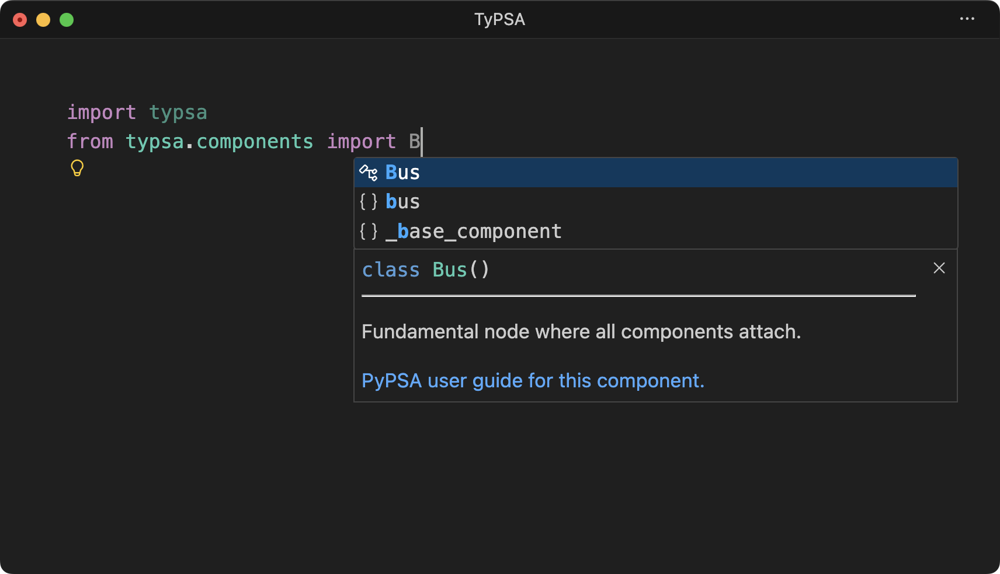
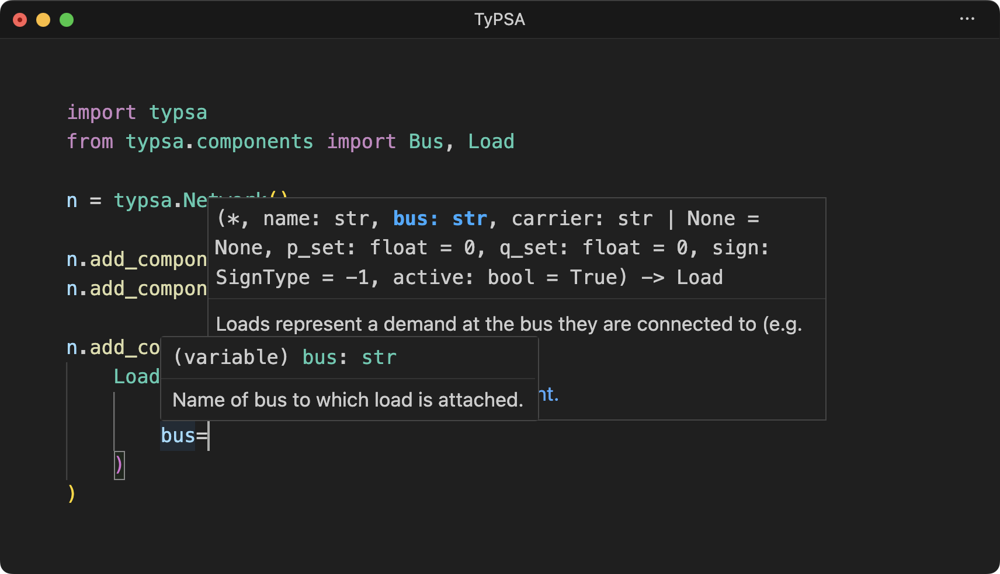
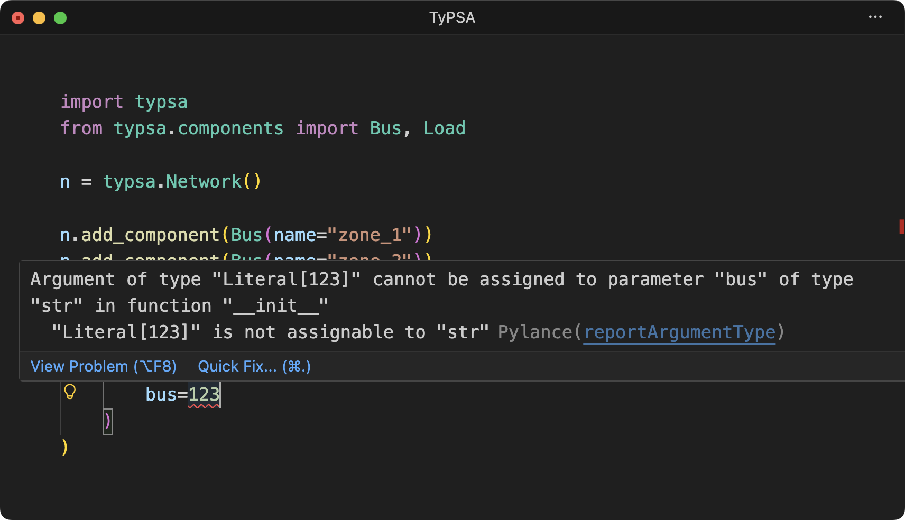
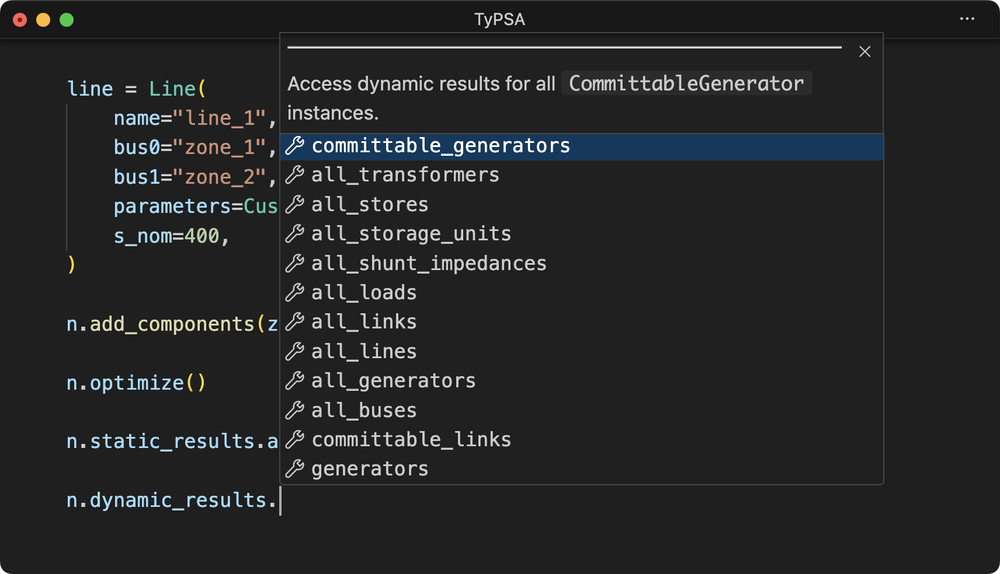
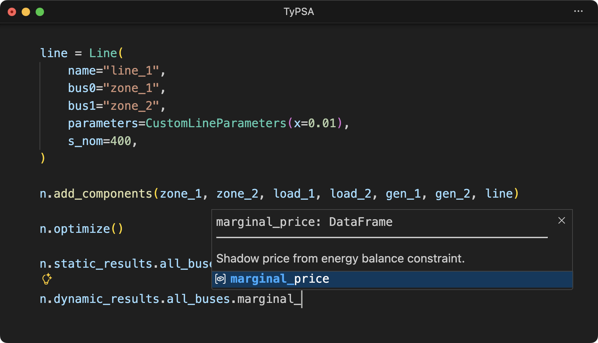

<div style="text-align: center; margin-right: 15px;"></img></div>

<h1 style="text-align: center;">TyPSA</h1>

TyPSA is a wrapper around the [PyPSA Python library for power systems analysis](https://docs.pypsa.org/latest/). TyPSA adds strong typing and data validation to PyPSA.

PyPSA is used for optimizing and simulating power grids. PyPSA provides a `pypsa.Network` object, which consists of a grid model. PyPSA has several types of components (bus, load, etc.) that can be added to a `pypsa.Network` object. For a given component type, PyPSA has many data attributes. Each of these data attributes are either inputs to the `pypsa.Network` and its underlying model, or an output thereof. Furthermore, each data attribute can be static (time invariant) or dynamic (time varying).

TyPSA provides:

- Classes for defining [components](components/index.md) of different types ([`Bus`](components/bus.md), [`Load`](components/load.md), etc.) with their input data.
- A subclass of `pypsa.Network` &mdash; [`typsa.Network`](network.md) &mdash; to which components can be added. Optimizations and power flow simulations can be run using `typsa.Network.optimize()`, `typsa.Network.pf()`, etc.
- Accessors for obtaining static and dynamic model outputs (e.g., `typsa.Network.static_results.extendable_generators["g1"].p_nom_opt`).

## Comparison

Working with TyPSA should feel very familiar to PyPSA users. See the below comparison of PyPSA versus TyPSA usage.

<div class="grid cards" markdown>

<div>

<h3>PyPSA Usage</h3>

Importing:

```py
import pypsa
 
```

Defining a network:

```py
n = pypsa.Network()

n.add("Bus", name="zone_1")
n.add("Bus", name="zone_2")

n.add(
    "Load",
    name="load_1",
    bus="zone_1",
    p_set=500,
)
n.add(
    "Load",
    name="load_2",
    bus="zone_2",
    p_set=1500,
)

n.add(
    "Generator",
    name="gen_1",
    bus="zone_1",
    p_nom=2000,
    marginal_cost=10,
    marginal_cost_quadratic=0.005,
)
n.add(
    "Generator",
    name="gen_2",
    bus="zone_2",
    p_nom=2000,
    marginal_cost=13,
    marginal_cost_quadratic=0.01,
)

n.add(
    "Line",
    "line_1",
    bus0="zone_1",
    bus1="zone_2",
    x=0.01,
    s_nom=400,
)
```

Optimizing a network:

```py
n.optimize()
```

Obtaining static results:

```py
n.buses
# ────┐
#     └─ Typed as `Any`.
 
```

```title="Output DataFrame"
        v_nom type    x    y carrier unit location  v_mag_pu_set  v_mag_pu_min  v_mag_pu_max control generator sub_network
name
zone_1    1.0       0.0  0.0      AC                         1.0           0.0           inf   Slack     gen_1           0
zone_2    1.0       0.0  0.0      AC                         1.0           0.0           inf      PQ                     0
```

Obtaining dynamic results:

```py
n.buses_t["marginal_price"]
# ──────┐
#       └─ Typed as `dict`.
 
 
```

```title="Output DataFrame"
name        zone_1    zone_2
snapshot
now       19.00009  35.00011
```

</div>

<div>

<h3>TyPSA Usage</h3>

Importing:

```py
import typsa
from typsa.components import Bus, CustomLineParameters, Generator, Line, Load
```

Defining a network:

```py
n = typsa.Network()

zone_1 = Bus(name="zone_1")
zone_2 = Bus(name="zone_2")

load_1 = Load(
    name="load_1",
    bus=zone_1.name,
    p_set=500,
)
load_2 = Load(
    name="load_2",
    bus=zone_2.name,
    p_set=1500,
)

gen_1 = Generator(
    name="gen_1",
    bus=zone_1.name,
    p_nom=2000,
    marginal_cost=10,
    marginal_cost_quadratic=0.005,
)
gen_2 = Generator(
    name="gen_2",
    bus=zone_2.name,
    p_nom=2000,
    marginal_cost=13,
    marginal_cost_quadratic=0.01,
)

line = Line(
    name="line_1",
    bus0="zone_1",
    bus1="zone_2",
    parameters=CustomLineParameters(x=0.01),
    s_nom=400,
)

n.add_components(zone_1, zone_2, load_1, load_2, gen_1, gen_2, line)
 
 
 
```

Optimizing a network:

```py
n.optimize()
```

Obtaining static results:

``` py
n.static_results.all_buses
# ─────────────┐ ────────┐
#              │         └─ Typed as `typsa.components.bus.BusStaticResults`.
#              └─ Typed as `typsa.network.StaticResults`.
```

```py title="Output"
{'zone_1': BusStaticResults(control='Slack', generator='gen_1', sub_network='0'),
 'zone_2': BusStaticResults(control='PQ', generator='', sub_network='0')}
 
 
```

Obtaining dynamic results:

``` py
n.dynamic_results.all_buses.marginal_price
# ──────────────┐ ────────┐ ─────────────┐
#               │         │              └─ Typed as `pandas.DataFrame`.
#               │         └─ Typed as `typsa.components.bus.BusDynamicResults`.
#               └─ Typed as `typsa.network.DynamicResults`.
```

```title="Output DataFrame"
name        zone_1    zone_2
snapshot
now       19.00009  35.00011
```

</div>

</div>

Using PyPSA, one often needs to consult the documentation to know:

- Which components are available.
- Which attributes each component type has, which of them are inputs or outputs, and which of them are static or dynamic.
- What are the types, valid values, and defaults for each attribute.
- Which attributes are compatible with each other.

With TyPSA, `typsa.components` lists available components. Each component class lists its attributes, and their types, validation, and defaults. Different subclasses are used to separate attributes of a given component type that are not compatible with each other. For example, the [`ExtendableLine`](components/line.md#components.line.ExtendableLine) class has the [`s_nom_mod`](components/line.md#components.line.ExtendableLine.s_nom_mod) attribute, but [`Line`](components/line.md#components.line.Line) does not. Similarly, on the output side, [`ExtendableLineStaticResults`](components/line.md#components.line.ExtendableLineStaticResults) has [`s_nom_opt`](components/line.md#components.line.ExtendableLineStaticResults.s_nom_opt), but [`LineStaticResults`](components/line.md#components.line.LineStaticResults) does not.

## Benefits of TyPSA

IDE autocomplete of which components are available, each with a description and a link to PyPSA's official documentation:



IDE autocomplete and type checking of component attributes:





IDE autocomplete of available results:




